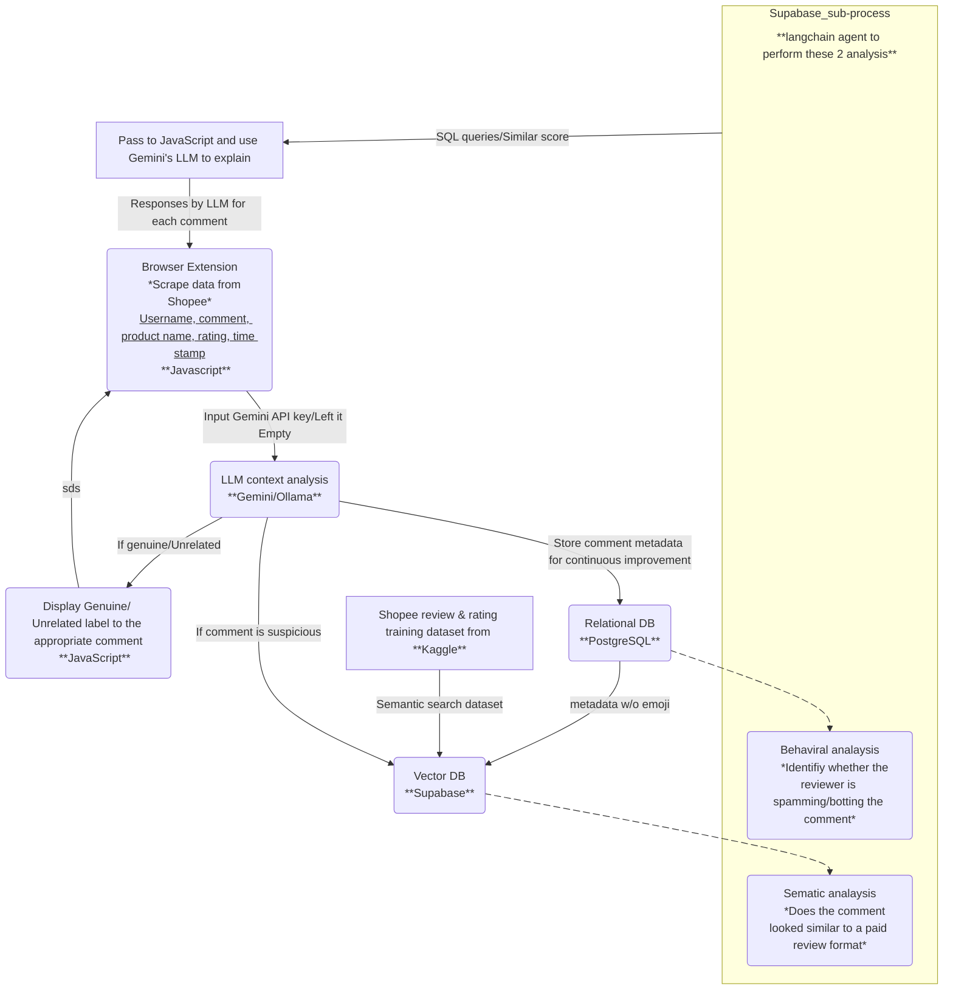

# Project Title & Tagline
Awesome Hackathon Project 🚀  
_A short, catchy description goes here._


## Demo Link & Screenshots

- **Live Demo:** [https://demo-link.com](https://demo-link.com)
- **Video/GIFs/Screenshots:**  
  


## Introduction

Brief overview of the project and its purpose.  
_What problem does it solve? Who is it for?_


## Features

- Feature 1: Describe key feature
- Feature 2: Another important functionality
- Feature 3: Something else cool


## How It Works / Architecture

Short explanation of how the project works.  
_High-level diagram below (if available):_

```
[ User ] --> [ Frontend ] --> [ Backend ] --> [ Database ]
```


## Tech Stack

- Frontend: React
- Backend: Node.js, Express
- Database: MongoDB
- Other: Docker, AWS S3


## Getting Started

### Prerequisites

- Node.js >= 18.x
- Docker (optional)

### Installation

```bash
git clone https://github.com/your-username/hackathon-project.git
cd hackathon-project
npm install
```

### Running the Project

```bash
# Start the development server
npm run dev

# (Optional) Using Docker
docker compose up
```


## Usage

- Access the main dashboard at `http://localhost:3000`
- API endpoint example:  
  `GET /api/items`
- CLI command example:  
  `npm run custom-script`


## Team / Contributors

- **Alice Smith** ([alicegithub](https://github.com/alicegithub)) – Frontend
- **Bob Lee** ([boblee](https://github.com/boblee)) – Backend
- **Charlie Kim** ([charliekim](https://github.com/charliekim)) – DevOps
