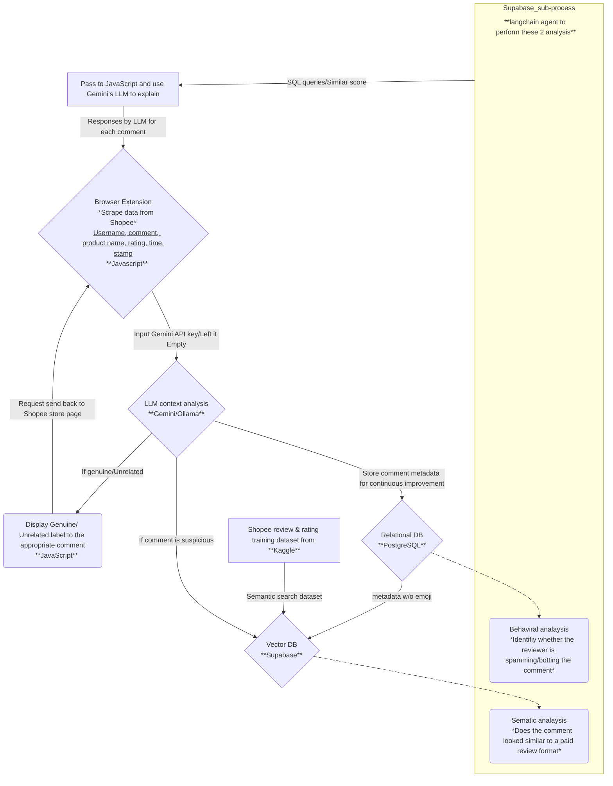

<p align="center">

</p>

<p align="center">Fake Review Detection System for Shopee.</p>


https://github.com/user-attachments/assets/c8724055-4e96-4b16-850f-6e7b35fde23e


<p align="center">
  <a href="https://www.canva.com/design/DAGtV-AFfiI/ZQ5Cc2ztLegeqHOW7wkb_g/view?utm_content=DAGtV-AFfiI&utm_campaign=designshare&utm_medium=link2&utm_source=uniquelinks&utlId=hc919ac8010">Slides Presentation</a>
</p>

**SpotCheck** is built to solve the problem of misleading reviews in online shopping. By combining a browser extension, LLM-powered backend, and a hybrid vector-relational database (Supabase), SpotCheck delivers real-time verdicts such as:

- ✅ Real  
- ❌ Fake  
- ⚠️ Irrelevant  

### How does it work?
1. **User visits** a Shopee product page.  
2. **Extension scrapes** all reviews.  
3. **Backend analyzes** each review using LLMs and past data.  
4. **Verdicts and explanations** are shown inline.
6. **User shops** with more confidence and clarity.


## 🎯 Types of Fake Reviews Detected

#### 1. **Paid or Sponsored Reviews**

* Overly positive language with little detail
* Keywords like “cheap”, “must buy”, “premium” spammed across unrelated products
* Appears across multiple users with only slight variations

#### 2. **Copy-Paste Spam**

* Same comment posted by different users
* Same user posts same/similar comment across multiple products
* Often used in review farms or bots

#### 3. **Template-Based Reviews**

* Generic structure like:
  *“Item arrived fast. Quality is good. Will buy again.”*
* Detected using semantic similarity (MiniLM + vector search)

#### 4. **Bot-Like Activity**

* Reviewer posts dozens of reviews in a short time
* Repeated review structure regardless of product
* Same review length, tone, and timing pattern

#### 5. **Irrelevant Comments**

* Comments that don’t match product context (e.g., review for a phone case saying “delicious and fresh”)
* Detected via LLM vibe-checking and embedding mismatch


## 🧭 Scope

- 🛒 Shopee as e-commerce platform
- 📌 Focused on shirts category for data collection
- 🐧 Linux-based local installation
- 🗝️ Optional Google GenAI API key deployment for easier deployment
- ☁️ Supabase Cloud for easy access to database

## 🔧 Technical Execution
### Solution Architecture



### Tech Stack

| Component         | Description                                      |
|------------------|--------------------------------------------------|
| **Browser Extension** | Scrapes and displays verdicts on Shopee          |
| **HTML/CSS/JS**           | Chromium-based browser extension development    |
| **FastAPI**          | Backend server managing LLM logic                |
| **MiniLM (Local)**   | Embedding generation and semantic analysis       |
| **Supabase**         | Relational + vector database backend             |
| **pgvector**         | Embedding similarity search                      |
| **Python**           | Data pipeline, inference, and backend logic     |


### Browser Extension

- **Scrapes data** from Shopee product pages:
  - Username  
  - Comment content  
  - Timestamp  
  - Star rating  
  - Product name  
  - Product URL  

- **Sends** the data to the backend server for the analysis.
- **Displays** final verdicts and explanations directly on the page.


### 🔍 Backend Analysis

#### PostgreSQL (Relational DB)

  * Stores metadata: username, timestamp, product info, etc.
  * Hosts external review datasets (e.g., [Kaggle 10k reviews](https://www.kaggle.com/datasets/shymammoth/shopee-reviews/code))
  * Enables behavior-based analysis using SQL queries

#### pgvector (Vector DB)

  * Stores sentence embeddings of review comments
  * Enables semantic similarity search (RAG-style logic)
  * Helps detect reused or templated comments across users/products


### 📈 Statistical Analysis Pipeline

#### Semantic Analysis

* Embeds each review comment using `all-MiniLM-L6-v2`.
* Performs vector similarity search via `pgvector`.
* Returns the **top 5 most similar comments** and similarity scores.
* Purpose: Detect bot/paid reviews that are **semantically similar** to known fake templates.

#### Behavior Analysis

Runs multiple SQL queries to extract behavioral patterns:

* Repetition: Has this user posted the **same comment** before?
* Duplication: How many **different users** posted this same comment?
* Spam: Is the comment reused **across multiple products**?
* Activity: How frequently does this user post reviews?
* Length: How long is the comment (character count)?


### 🧠 LLM Decision Pipeline

| Stage     | Description                                                                  |
| --------- | ---------------------------------------------------------------------------- |
| **LLM 1** | Classifies review as **Genuine / Suspicious / Irrelevant** (based on "vibe") |
| **LLM 2** | Further evaluates *Suspicious* reviews using semantic + behavioral evidence  |

> Suspicious reviews flagged by LLM 1 are sent through both semantic + behavioral analysis. Verdicts are generated based on aggregated insights.

> If Gemini API key is not provided, the system defaults to the local Ollama model.

### Continuous Learning


* **Live feedback loop**: New reviews are stored for retraining purposes.
* **Fine-tuning**: External datasets (e.g. Kaggle) used to improve classification accuracy.
* **Preprocessing**: Comments are cleaned (emoji stripping, whitespace removal) to improve vector quality and matching performance.


## 📥 Deployment

### Cloud Deploy (Minimal Setup)

#### Requirements

* **Python 3.12.3** – for running the backend server
* **Chromium-based browser** – required for the extension (e.g., Chrome, Brave)
* **Google Gemini API Key** – [Get your API key here](https://aistudio.google.com/app/apikey)


#### 1. Backend Setup

Clone the repository and install dependencies:

```bash
git clone https://github.com/your-repo-name/SpotCheck.git
cd SpotCheck
pip install -r requirements.txt
```

Run the backend server:

```bash
python ./backend/backend.py
```

#### 2. Install Browser Extension

1. Open your Chromium browser
2. Navigate to: `chrome://extensions/`
3. Enable **Developer Mode** (top-right toggle)
4. Click **"Load unpacked"**
5. Select the `src/` folder from the cloned repo
6. Click the extension in the browser
7. Put Google Gemini API key in the browser popup

### Local Deployment (Recommended)
Installation steps included in [INSTALL.md](https://github.com/tzhenyu/SpotCheck/blob/main/INSTALL.md)

## 🏎️ Performance
| Run        | `analyze_comments` (Local LLM) | `analyze_comments` (Gemini LLM) |
| ---------- | ------------------------------ | ------------------------------- |
| 1          | 4.08                           | 14.57                           |
| 2          | 4.84                           | 24.44                           |
| 3          | 4.55                           | 25.17                           |
| 4          | 11.09                          | 16.54                           |
| 5          | 11.15                          | 11.18                           |
| **Avg** | **7.14s**                      | **18.38s**                      |


Local LLM is **~61.14%** faster than Gemini LLM on average.

## ❓ Why not using agentic tools?
We've tried using LangChain Agent to allow local deployed LLM to decide which analysis to perform to determine if the review is real or fake. It took around a minute to process due to its chain of thoughts. We didn't try using Gemini LLM on LangChain Agent as we are concerned with the network latency. But hey, at least we tried :')

## ✅ Real results
Work in progress gang

## 🙌 Credits
Brought to you by team **TARUMT NOT TARC**
- TAN ZHEN YU
- JONATHAN HO YOON CHOON
- LYE WEI LUN
- TAN GUO ZHI


